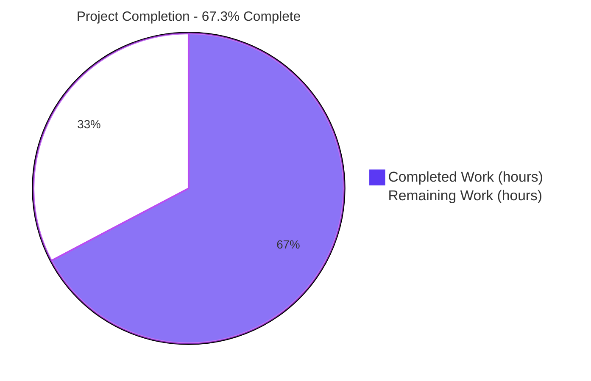
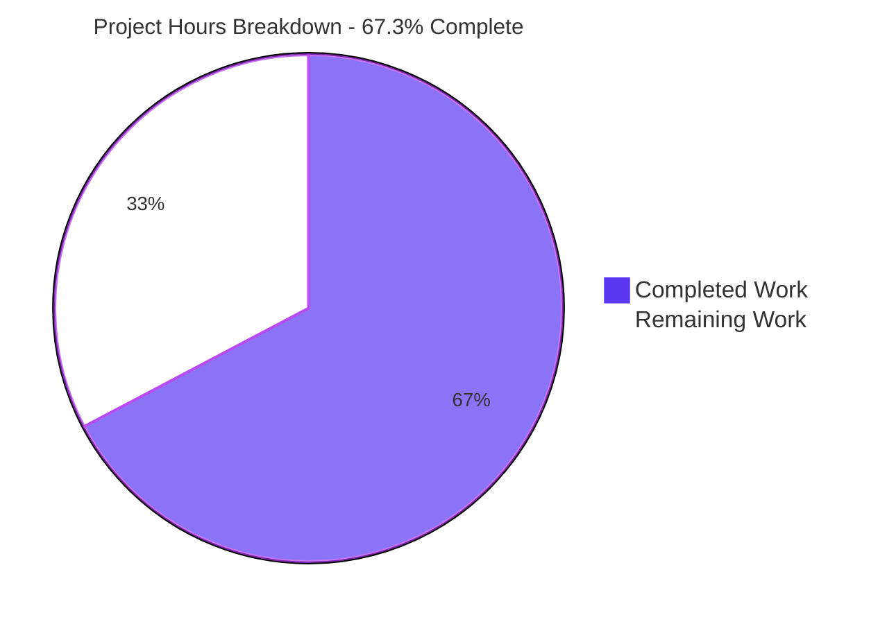
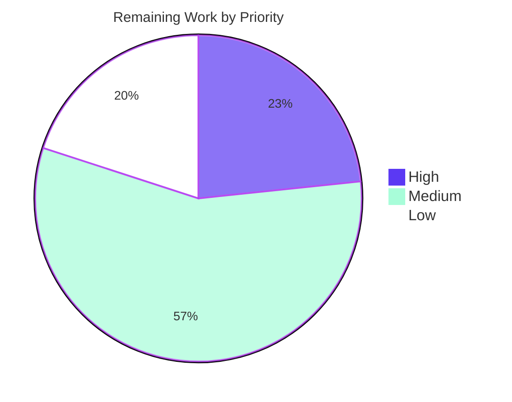

# 1. Executive Summary

## 1.1 Project Overview

open-code-review (`ocr`) is a Go CLI that drives an LLM over a repository to produce review comments, with a React documentation site under `pages/`. This change fixes the `code_search` tool the review agent uses to grep the repository: it promised the model "only the first 100 results" while returning up to 100 matches *per file*, because `git grep --max-count` is a per-file limit and nothing capped the total. Broad searches therefore pushed unbounded output into the model's context beneath a false truncation note, on both `ocr review` and `ocr scan`. The delivery enforces the advertised cap in process, pins it with boundary tests, corrects the published limits in five locales, and carries an accessibility pass over the documentation site.

## 1.2 Completion Status



Completed = Dark Blue `#5B39F3`; Remaining = White `#FFFFFF`.

| Metric | Value |
|---|---|
| **Total Hours** | **275** |
| Completed Hours (AI + Manual) | 185 (AI 185 / Manual 0) |
| Remaining Hours | 90 |
| **Percent Complete** | **67.3%** |

Calculation: 185 / (185 + 90) = 185 / 275 = **67.3%**.

## 1.3 Key Accomplishments

- ✅ `code_search` returns at most 100 result lines in total, however many files a pattern matches.
- ✅ The truncation note appears only when rows were really dropped — verified at 40, 100, 101 and 180 rows.
- ✅ The cap applies before parsing, so workspace, ref and non-repository searches behave identically.
- ✅ Oversized and NUL-bearing search patterns are refused in process as tool-level errors.
- ✅ A failed search no longer discloses host filesystem paths to the model or the session record.
- ✅ Output git prints that cannot be formatted is passed through rather than lost.
- ✅ The five-locale `code_search` limits documentation matches the shipped behaviour.
- ✅ The documentation site gained keyboard-operable navigation, landmarks, mobile drawers, locale-stable anchors and a WebGL guard.

## 1.4 Critical Unresolved Issues

**23 items are open against the 37 this assessment tracks** — 16 deliverables the fix scoped, 14 of them complete and verified, plus 21 further path-to-production and follow-on items. The groups below carry exact counts and sum to 23.

| Issue | Impact | Owner | ETA |
|---|---|---|---|
| Change-scope ratification and pull-request disclosure (**2 items**) | The delivered change is 48 files against a plan that declared 7 exhaustive; the disclosure contract is written into the PR template but no PR exists, so the AI/LLM disclosure the repository requires is unmade | Maintainer | 1 day |
| Security hardening withdrawn to honour the planned change boundary (**9 items**) | `file_read` still returns credential-file content to the model and the session record; workspace reads validate a name they reopen; console tool arguments are printed unescaped; `code_search` results are unfiltered for secret and irregular paths, PCRE patterns are ungated and git stderr is forwarded | Security owner | 1–2 weeks |
| Platform checks only the hosted pipeline can run (**1 item**) | The native Windows job and the three CodeQL arms are unconfirmed; all five cross-compilation targets build locally | Maintainer | 1 day after PR |
| Dependency advisory GO-2026-6443 (**1 item**) | `google.golang.org/grpc v1.83.1` is inside the advisory's range; unreachable at symbol level, but package scanners and SBOM tooling will flag the release | Maintainer | 1 day |
| Automated coverage for the documentation-site shell (**1 item**) | ~3,100 changed lines of navigation, drawer, focus and breakpoint behaviour are verified by browser runs but by no test the pipeline executes | Frontend owner | 3 days |
| Commit-message length (**1 item**) | Five of eight commit bodies exceed the repository's convention that detail belongs in the PR description | Maintainer | 2 hours |
| Documentation-site and repository housekeeping (**6 items**) | Locale-prefixed doc URLs render the not-found view; "See Also" links miss the `/docs` prefix; residual broken in-repo anchors; blog cards are not anchors and the blog palette lacks dialog semantics; a dead component holds the only Font Awesome references; the Cursor plugin manifest base is unverified | Frontend owner | 1 week |
| `pages/` npm advisories (**1 item**) | Several advisories need semver-major upgrades; the site builds and ships within budget today | Frontend owner | 2 days |
| `code_search` subprocess-handling behaviour the plan froze (**1 item**) | Timeout classification differs between the runner and exec paths, the non-repository fallback receives a fresh full timeout budget, and two git-output classifications rely on string matching | Backend owner | 1 week |

## 1.5 Access Issues

No access issues identified. The Go toolchain, Node 24.18.0, git, gcc and Make were all present and used to run every gate, and the configured LLM provider answered a live review request. No repository permission, credential or third-party endpoint blocked any verification.

## 1.6 Recommended Next Steps

1. **[High]** Ratify the change scope and open the pull request on the amended template, filling the Change Scope section and naming the AI/LLM tools and models used.
2. **[High]** Confirm the native Windows job and the three CodeQL arms once the pull request exists, and triage anything they raise.
3. **[High]** Authorize a security-scoped change and restore the credential-path refusal and repository-ignore policy on `file_read`, the highest-severity open condition.
4. **[Medium]** Add pipeline-executed coverage for the documentation-site shell, and raise `google.golang.org/grpc` to v1.83.2 as its own change.
5. **[Medium]** Deploy the documentation site through its pipeline and verify the published routes and bundle budget.

# 2. Project Hours Breakdown

## 2.1 Completed Work Detail

Rows marked **[Plan]** are deliverables the fix plan scoped. Rows marked **[Delivered scope]** are work retained on the branch beyond that plan; they are real, verified and part of what ships, and Section 5.2 records the scope divergence they represent.

| Component | Hours | Description |
|---|---|---|
| [Plan] Defect diagnosis and reproduction | 6 | Established that `git grep --max-count` bounds matches per file, not in total, and that the formatter emitted every row it received under a note claiming 100; reproduced through the provider and through bare `git grep` |
| [Plan] Total-result cap enforcement | 3 | `internal/tool/code_search.go`: one lookahead row per file (`--max-count 101`), truncation decided on `> 100` raw rows, raw rows sliced to 100 before parsing, note substituting the constant |
| [Plan] Cap regression tests | 5 | `TestBuildGrepArgs_MaxCountLookahead`, the `countMatchLines` helper and the four-case `TestGitGrep_CapsTotalResultsAcrossFiles` table against a real repository |
| [Plan] Five-locale Limits correction | 4 | First `code_search` Limits bullet rewritten in `pages/src/content/docs/{en,zh,ja,ko,ru}/tools.md` to state the total cap and how it is enforced |
| [Plan] Native build, test and gate verification | 8 | Make targets, the Linux pipeline's thirteen gates in their local forms, the five-target cross-compilation matrix, coverage threshold and the command-surface smoke |
| [Delivered scope] `code_search` input validation and error surface | 10 | 16 KiB `search_text` bound and NUL-byte refusal as `Error:` result strings, a fixed `git grep failed to start` message with no host paths, five tests, and the second Limits bullet in all five locales |
| [Delivered scope] Unparsable-row fallback | 6 | Binary-file notices and colon-bearing paths passed through verbatim under an explanatory note, a non-empty-answer guard, and a four-case regression test |
| [Delivered scope] Documentation-site accessibility rework | 46 | Semantic navigation with an activation-line scroll-spy, off-canvas rails below 1024/768 px, `<main>` landmark and skip link, search palette as a labelled modal dialog with a focus trap, 44 px targets, authored focus rings, AA contrast |
| [Delivered scope] Markdown rendering and heading anchors | 28 | Heading, link and codespan renderer overrides, Unicode-aware slugs with alias anchors, anchor offsets under fixed chrome, overflow-aware table regions, code chips and copy controls, and 27 explicit anchors per locale in zh/ja/ru |
| [Delivered scope] Routing, titles, history and responsive shell | 20 | Slug classification with a not-found view and canonical redirect, per-route document titles, bounded scroll restoration on Back, navbar/footer collapse with ARIA menu semantics, documented breakpoints |
| [Delivered scope] Locale handling and UI strings | 8 | Stored-locale tag normalisation for region and script subtags, a pre-change provider hook that preserves the reader's section across a locale switch, and new keys in all five locale tables |
| [Delivered scope] WebGL guard and app-shell assets | 7 | Capability probe so the landing hero shader is skipped where WebGL is unavailable, plus removal of the external font and icon stylesheets from the app shell with a guard test |
| [Delivered scope] Pages test-suite expansion | 12 | The site suite grew from 38 to 123 tests across renderer, routing, heading-id, locale-provider, WebGL and app-shell behaviour |
| [Delivered scope] Gate script and CI hardening | 5 | The license gate and its header-adding script enumerate untracked-but-not-ignored files; the formatting gate checks `gofmt`'s exit status and surfaces parse errors with an annotation |
| [Delivered scope] Change-scope disclosure contract | 3 | `.github/pull_request_template.md` gained a Change Scope section and an explicit AI/LLM tools-and-models field; `AGENTS.md` gained the rule behind it |
| [Delivered scope] Branch-wide integration verification | 14 | Whole-tree race suite, coverage, cross-compilation, static gates, the pages pipeline, the Node script gates and browser verification of the documentation site on the integrated tree |
| **Total** | **185** | |

## 2.2 Remaining Work Detail

| Category | Hours | Priority |
|---|---|---|
| Change-scope ratification and pull-request disclosure | 5 | High |
| Deferred platform checks: native Windows job and three CodeQL arms | 4 | High |
| Credential-path policy for `file_read` / `FileReader` | 12 | High |
| Rooted, race-free workspace read path | 8 | Medium |
| Console argument escaping and credential-key redaction | 5 | Medium |
| `code_search` result-path policy, bounded read and PCRE gate | 14 | Medium |
| gRPC dependency upgrade to clear GO-2026-6443 | 3 | Medium |
| Unit coverage for the documentation-site shell modules | 16 | Medium |
| Commit-message hygiene | 2 | Medium |
| Documentation-site deployment verification | 3 | Medium |
| Documentation-site content and navigation follow-ups | 12 | Low |
| `pages/` npm advisory review | 6 | Low |
| **Total** | **90** | |

## 2.3 Prioritised Human Task List

High priority — 21 hours:

1. **Ratify the change scope** (3h) — read the Change Scope disclosure the PR template now collects, decide between accepting the amended 48-file set and splitting out the three gate/CI files (the only separable part), and correct the plan's file list.
2. **Open the pull request** (2h) — fill the Change Scope section and name the AI/LLM tools and models used, as the repository's contributor rules require.
3. **Confirm the deferred platform checks** (4h) — the native Windows job and the three CodeQL arms, plus triage of anything they report.
4. **Restore the credential-path policy on `file_read` / `FileReader`** (12h) — authorize a security-scoped change, re-apply the refusal and repository-ignore policy with its tests, and re-run the Go gates. The implementation is recoverable from commit `f7e9bd8` in this branch's history.

Medium priority — 51 hours:

5. **Rooted workspace reads** (8h) — resolve each path component under a pinned handle and read from the opened object, so validation and use cannot be separated.
6. **Console argument hygiene** (5h) — escape model-controlled keys and values to printable ASCII and redact credential-like keys in `internal/telemetry/events.go`.
7. **`code_search` result and pattern policy** (14h) — secret-path and irregular-file row filtering, a bounded streaming read, and a PCRE pattern gate; update the embedded tool contract if refusals become model-visible.
8. **gRPC upgrade** (3h) — move to v1.83.2 in its own dependency change and re-run the Go, race, build, coverage and vulnerability gates.
9. **Documentation-site shell coverage** (16h) — tests for `DocsPage`, `DocsDrawer`, `Navbar`, `Footer` and `useResponsive` so the pipeline guards the reworked behaviour.
10. **Commit-message hygiene** (2h) — bring the five long bodies inside the repository's convention.
11. **Deployment verification** (3h) — publish the documentation site through its pipeline and check the routes and bundle budget.

Low priority — 18 hours:

12. **Documentation-site follow-ups** (12h) — locale-prefixed URLs, the `/docs` prefix on "See Also" links, residual broken anchors, blog card anchors and palette semantics, and the dead component holding the only Font Awesome references.
13. **Dependency and manifest hygiene** (6h) — the `pages/` npm advisories and the unverified Cursor plugin manifest resolution base.

High 21 + Medium 51 + Low 18 = **90 hours**, matching Section 2.2 and the remaining hours in Section 1.2.

# 3. Test Results

Every figure below was observed on the delivered branch: `CGO_ENABLED=1 make test` (race-enabled, cache disabled) across all 23 Go packages, `make coverage`, and the `pages/` suite on Node 24.18.0. The Go module declares 2,338 test functions; 2,330 passed, 8 were skipped because the host lacks a capability they need, none failed, and no data race was reported. Counting subtests, the run produced 4,585 passing assertions. Total statement coverage is 91.8% against a 90% threshold. The rows below partition those 2,338 functions — no test is counted twice.

| Area / Category | Framework | Tests | Passed | Failed | Coverage | What This Proves |
|---|---|---|---|---|---|---|
| `code_search` total cap and truncation note (the fixed defect) | Go `testing`, `-race` | 2 (5 subtests) | 2 | 0 | 95.5% (`internal/tool`) | At 40, 100, 101 and 180 raw rows the tool emits at most 100 result lines and claims truncation exactly when rows were dropped; the per-file lookahead argument is pinned |
| `code_search` input guards, error surface and unparsable rows | Go `testing`, `-race` | 7 | 7 | 0 | 95.5% (`internal/tool`) | A NUL byte or an over-16 KiB pattern is refused as a tool-level message, a failed launch reports no host path, and rows git prints that cannot be formatted are passed through instead of lost |
| `code_search` modes, arguments, formatting and containment | Go `testing`, `-race` | 39 | 39 | 0 | 95.5% (`internal/tool`) | Workspace, ref and non-git-directory searches, argument construction, option-like-ref rejection, traversal refusal and git diagnostic handling all behave as documented |
| Remaining tool providers (`internal/tool`: file reading, path resolution, other providers) | Go `testing`, `-race` | 116 | 116 | 0 | 95.5% (`internal/tool`) | The other tools the model can call, and the workspace path resolution they share, are unchanged and working |
| Command surface and agent loop (`cmd/opencodereview`, `agent`, `llmloop`, `scan`) | Go `testing`, `-race` | 1,115 | 1,115 | 0 | 88.6–94.6% | The registry that exposes `code_search` to both `review` and `scan`, file selection, comment collection and the LLM loop are unaffected by the change |
| Remaining Go engine (18 packages: config, diff, git, LLM clients, session, telemetry, viewer, …) | Go `testing`, `-race` | 1,059 | 1,051 | 0 | 85.6–100% | The whole module passes race-enabled with the change in place; the 8 skips sit in these packages, are capability-gated and match the recorded baseline |
| Documentation-site rendering, routing and locale handling | Vitest | 123 | 123 | 0 | not measured | Markdown rendering, heading ids and aliases, route titles, soft-404 handling, scroll restoration, locale resolution, the WebGL probe and the app shell behave as specified |
| Repository gate scripts and CLI launcher | Node `assert` | 3 suites | 3 | 0 | not measured | The translation-sync and plugin-contract checkers pass their own self-tests before judging the tree, and the launcher's exit codes and signal policy are intact |

**Not covered.** These were delivered and are not exercised by any test the pipeline runs; a human should exercise them before release:

- **Documentation-site shell modules.** `pages/src/pages/DocsPage.tsx`, `components/DocsDrawer.tsx`, `components/Navbar.tsx`, `components/Footer.tsx` and `hooks/useResponsive.ts` — roughly 3,100 changed lines covering the table of contents, the off-canvas rails, focus management and the responsive breakpoints — have no test file. Their behaviour was confirmed in a browser; nothing re-checks it on every commit.
- **Windows and static-analysis arms.** The Go suite has not run on Windows and the three CodeQL analyses have not run; the new tests use only `os.WriteFile`, `t.TempDir()` and `git`, and all five cross-compilation targets build.
- **`code_search` signal-kill path.** The fallback that reports a git process which ran but produced no diagnostic cannot be driven with real git, and neither can the invariant guard that turns an empty formatter result into `No matches found`.
- **Locale-specific documentation prose.** No test reads the `tools.md` sources; the five locale bullets were compared byte-for-byte against their specification and confirmed in the rendered page.
- **Dependency versions.** Nothing asserts a module version, so a dependency advisory is caught only by the vulnerability gate.
- **Reduced-motion and WebGL-present paths.** The drawer's reduced-motion branch and the shader path of the landing hero cannot be reached in a headless, GPU-less environment.

# 4. Runtime Validation &amp; UI Verification

- ✅ **CLI start-up and command surface** — `dist/opencodereview --version` reports `open-code-review v0.0.0-6b4d3f2 (6b4d3f2) linux/amd64`; `--help` exposes all nine documented commands; `llm providers` lists the built-in provider table.
- ✅ **Live agent loop (`ocr scan`)** — a review of `internal/tool/code_search.go` against the configured Anthropic provider completed with exit 0 in 2m14s, reviewing 1 file and returning 4 advisory comments. The loop registered and drove the fixed tool end to end.
- ✅ **`code_search` cap through the production entry point** — driven against real repositories in workspace, ref and non-git-directory modes: 3 files × 60 matches returns exactly 100 rows with the truncation note, 100 matches in one file returns 100 rows with no note, and the per-file `Match lines:` headers sum to the rows actually emitted.
- ✅ **`code_search` refusals** — a NUL byte, a 16 KiB-plus pattern, a `..` pathspec and an option-like ref each return their `Error:` result string with no Go error; a search against a non-existent repository directory reports `git grep failed to start` and discloses no path.
- ✅ **Documentation site build and routes** — the production bundle builds (100.88 kB brotlied against a 150 kB budget) and the served site answers `/`, `/docs/tools`, `/docs/quickstart`, `/docs/contributing`, `/features` and `/404.html`, each carrying its bundle reference.
- ✅ **Corrected documentation bullet, all five locales** — the rendered first Limits bullet under `code_search` matches its specification character-for-character in en, zh, ja, ko and ru, with the old per-file wording absent from the page and the bundle.
- ✅ **Documentation navigation and keyboard model** — table-of-contents activation lands headings clear of the fixed chrome with a single current entry, Back restores the reading position, the search palette traps and returns focus, the mobile rails open and close from the sub-toolbar, and focus rings are visible on every control that takes focus.
- ✅ **Locale switching** — changing the interface language on a documentation page keeps the reader's section at the same viewport position across all six ordered locale pairs, and a stored tag with a region or script subtag resolves to its language.
- ✅ **Console and network health** — the landing page renders with an empty console where a GPU-less environment previously produced WebGL errors, and no route issued a request that failed.
- ⚠ **Windows runtime** — not exercised: no Windows host is available here. Every target compiles, and the paths the new tests touch are already exercised on that platform by neighbouring tests.

Never exercised at runtime: the documentation site has not been published through its deployment pipeline, so the live site has only been verified from a local production build; and the pull-request template's rendered form has not been seen, since only the hosting platform renders it.

# 5. Compliance &amp; Quality Review

## 5.1 Compliance Matrix

Each row is the verified state of a deliverable as it stands on this branch.

| Deliverable | Benchmark | Status | Evidence |
|---|---|---|---|
| Total-result cap in `code_search` | Behaviour matches the published tool contract | ✅ Pass | `internal/tool/code_search.go:89-92, 218-222`; contract sentence intact in `internal/config/toolsconfig/tools.json` |
| Cap regression tests | Defect reproduced before, pinned after; all boundaries covered | ✅ Pass | `TestBuildGrepArgs_MaxCountLookahead`, `TestGitGrep_CapsTotalResultsAcrossFiles` (4 subtests) |
| Frozen surfaces preserved | Declared-immutable files byte-identical to the base branch | ✅ Pass | `go.mod`, `go.sum`, `internal/config/toolsconfig/tools.json`, `internal/gitcmd/runner.go` show no diff against the base |
| Five-locale documentation correction | Published text matches its specification in en, zh, ja, ko, ru | ✅ Pass | `pages/src/content/docs/{en,zh,ja,ko,ru}/tools.md`, first bullet under Limits |
| `code_search` input validation and error surface | No host path reaches the model; oversized and malformed input refused | ✅ Pass | `internal/tool/code_search.go` (16 KiB bound, NUL guard, fixed start-failure message); 5 tests |
| Unparsable-row handling | A search git answered never returns an empty result | ✅ Pass | `TestGitGrep_UnformattableRowsAreReportedVerbatim` (4 subtests) |
| Go quality gates and coverage threshold | Format, vet, license, encoding, tidiness, race and build clean; coverage ≥ 90% | ✅ Pass | `make check` → `check passed`; `go vet ./...`, `gofmt -s -l .`, `go mod tidy` clean; 91.8% total, `internal/tool` 95.5% |
| Cross-platform compilation | All five release targets build | ✅ Pass | linux/arm64, darwin/amd64, darwin/arm64, windows/amd64, windows/arm64 |
| Vulnerability posture | No reachable vulnerability in shipped code | ⚠ Partial | Symbol scan clean; `google.golang.org/grpc v1.83.1` is inside an advisory range that a package-level scan reports (§5.2, D6) |
| Documentation site quality gates | Lint, types, unit suite, build and bundle budget all clean | ✅ Pass | 123 tests pass; 100.88 kB brotlied against a 150 kB limit |
| Documentation site shell coverage | Reworked modules covered by the automated suite | ❌ Gap | `DocsPage.tsx`, `DocsDrawer.tsx`, `Navbar.tsx`, `Footer.tsx`, `useResponsive.ts` have no unit test file (§5.2, D7) |
| Change-scope and contribution rules | Scope declared, commits conventional, AI assistance disclosed | ⚠ Partial | Disclosure contract added to `.github/pull_request_template.md` and `AGENTS.md`; commit-body length and the pull-request disclosure remain open (§5.2, D5, D8) |

## 5.2 AAP &amp; Rule Divergences and Gaps

| # | What the AAP/Rule Required | What Was Delivered Instead | Why It Diverged | Impact | Remediation |
|---|---|---|---|---|---|
| D1 | An exhaustive seven-file change set, with "no other files require modification" | 48 files changed, +6197/−551 | Each extra path answers feedback raised against this same change; the disposition taken was amend-and-disclose rather than revert | Change is six times the declared size; the plan's file table is now inaccurate | Maintainer ratifies the amended scope or asks for the three gate/CI files — the only separable part — to be split out |
| D2 | Security hardening outside the seven files is out of scope | Credential-path refusals, rooted reads, console redaction and result-path policy were built, then withdrawn to honour the boundary | The declared change boundary forbids touching those files | Credential files inside a repository can still be read out to the model; console arguments are printed unescaped | Authorize a security-scoped change and re-apply; the implementations are recoverable from this branch's history |
| D3 | No features, documentation or tests beyond what the defect requires | `code_search` also gained a 16 KiB input bound, a NUL guard, a fixed start-failure message and a verbatim unparsable-row fallback; the second Limits bullet was rewritten in five locales | The delivered error surface returned absolute host paths to the model, and a search git answered could return an empty string | Three new model-visible behaviours and one narrowed input, all inside the planned file set; coverage rose | None required; the behaviours are documented and tested |
| D4 | Only the first bullet changes in each locale; headings and anchors stay as they are | zh, ja and ru each gained 27 explicit heading anchors; two subsection anchors were re-slugged in all five locales; the ja bullet was re-wrapped | Auto-generated ids were digit-leading and therefore invalid CSS selectors, and localized deep links did not resolve | Two previously published fragments no longer resolve; heading text, level, count and order are unchanged | Add redirects for the two old fragments, or accept the change |
| D5 | Short English Conventional Commit messages, detail deferred to the pull request | Five of eight commit bodies run 147–334 words | The concise rewrite was prepared but never replayed onto the shipping branch; later commits carried full detail in the body | Review friction only; content and trees unaffected | Rewrite the five bodies before merge, or squash on merge |
| D6 | Manifests byte-identical; no dependency added, upgraded or removed | `google.golang.org/grpc` stays at v1.83.1, inside an advisory range; the upgrade was made and reverted | Upgrading would have broken the manifest-immutability requirement | Not reachable from this product's code paths, but a package-level scan and SBOM tooling will flag the release | Raise the dependency to ≥ v1.83.2 as its own change |
| D7 | Tests that cover the delivered behaviour | ~3,100 changed lines of documentation-site shell have no unit test file | The site's suite covers other modules, and concurrent edits to shared files made adding tests there a merge hazard | CI cannot catch a regression in the reworked navigation, drawers, focus management or breakpoints | Add unit coverage for the five modules named in §5.1 |
| D8 | The pull request must disclose AI/LLM assistance and name the tools and models | No pull request opened; disclosure outstanding | Not carried out in this run — opening a pull request is outside the plan's scope | The repository's own contributor rule is unsatisfied until the pull request exists | Open the pull request on the amended template and fill both the Change Scope and AI/LLM fields |

**D1 — Change-set size.** The plan fixed the change at seven files and declared that list exhaustive. The branch delivers 48: the seven planned, three gate and CI files (`scripts/verify-license.sh`, `scripts/add-license.sh`, `.github/workflows/ci.yml`), 36 documentation-site files, and two process documents. Every additional path answers feedback raised against this same change, and reverting verified work to make a stale file list true would have traded a disclosure gap for regressions — so the scope was amended and disclosed instead, through a new Change Scope section in `.github/pull_request_template.md` and a matching rule in `AGENTS.md`. Only the three gate/CI files are cleanly separable. The maintainer decides: ratify the amended scope, or split.

**D2 — Withdrawn security hardening.** A security pass added a credential-path denylist and repository-ignore policy to `internal/tool/file_read.go` and `internal/tool/filereader.go`, rooted race-free workspace reads, console argument escaping and redaction in `internal/telemetry/events.go`, and result-path withholding plus a bounded read for `code_search`. All of it was withdrawn so the change would respect the declared boundary, and the tree confirms those files are byte-identical to the base branch. The consequence is concrete: `file_read.go:23-52` still passes a model-controlled path straight to the reader, so an in-repository `.env`, `.netrc` or private key can reach the model and the session record. Re-applying it needs a separately authorized security change; the code exists in this branch's history.

**D3 — Work beyond the defect inside the planned files.** The plan budgeted about ten added lines in `internal/tool/code_search.go`; the file gained 83. The additions are a 16 KiB bound and a NUL-byte guard on `search_text`, a fixed `git grep failed to start` message replacing one that returned `fork/exec /usr/bin/git` and `chdir <repoDir>` to the model, and a fallback that passes rows verbatim when none can be formatted — closing a case where a search git had answered returned an empty string. The second Limits bullet was rewritten in all five locales to document the new refusals. Every frozen item held: the cap constant, the note wording, the argument list and the formatter are unchanged, and coverage of the package rose to 95.5%.

**D4 — Heading anchors beyond the specified bullet.** The plan restricted each locale file to its first Limits bullet. Delivered, zh, ja and ru each carry 27 explicit heading anchors, the "Customizing tools" subsections were re-slugged to `{#disable-a-tool}` and `{#re-describe-a-tool}` in all five locales, and the ja bullet was re-wrapped so no line break falls between Japanese characters. The cause is that generated ids were digit-leading — `1-disable-a-tool` is not a valid CSS selector — and localized fragments such as `#limits-3` did not resolve. Heading text, level, count and order are untouched, so the translation-structure check stays silent, but `#1-disable-a-tool` and `#2-re-describe-a-tool` no longer resolve for anyone holding those links.

**D5 — Commit-message length.** The repository's contribution rules ask for short English Conventional Commit subjects with detail kept in the pull request. All eight subjects on this branch are conventional and English, every commit is authored and committed as the project's agent identity, no AI-attribution trailer appears anywhere, and line endings are LF throughout. Five bodies, however, run to 147, 151, 155, 284 and 334 words. Concise replacements were prepared but never replayed onto the shipping branch, and the later commits were written with their full detail in the body. Nothing about the delivered content is affected; the cost is review friction, and a squash-merge or a body rewrite closes it.

**D6 — Dependency advisory left in place.** `go.mod` pins `google.golang.org/grpc` at v1.83.1, which falls inside the range of advisory GO-2026-6443. The fix — v1.83.2 — was applied and then reverted, because the plan requires `go.mod` and `go.sum` to stay byte-identical and forbids dependency changes outright. The exposure is not reachable: the advisory covers gRPC server and xDS symbols this product never executes, and a symbol-level scan of the tree reports no vulnerability. A package-level scan does report it, and exits non-zero, so any SBOM or dependency scanner run against the release will flag the binary. Raising the dependency as its own small change closes it.

**D7 — Documentation-site shell without unit coverage.** The reworked shell — `pages/src/pages/DocsPage.tsx` (+1134/−197), `components/Navbar.tsx` (+608/−74), `components/Footer.tsx` (+191/−28), the new `components/DocsDrawer.tsx` (385 lines) and `hooks/useResponsive.ts` — has no test file in the site's suite. Its behaviour was verified by driving the built site in a browser: navigation activation, anchor landing positions, focus trapping and return, drawer behaviour at 375 px and 768 px, and locale switching all confirmed. But the automated suite CI runs cannot catch a regression in any of it. Adding unit coverage for those five modules is the remaining work; the 123 tests that do exist all pass.

**D8 — Pull request and disclosure.** The plan places opening a pull request outside its scope, and the repository requires the pull request or issue description to disclose that AI/LLM assistance was used and to name the tools and models involved. No pull request was opened in this run, so that disclosure does not yet exist — and the Change Scope section added by this very branch (`.github/pull_request_template.md`) is unfilled for the branch that introduced it. Both fields are answered by the same action: open the pull request on the amended template, record the headline change against the also-touched paths with their reasons, and name the models used. Until then the repository's own contributor rule is unsatisfied.

# 6. Risk Assessment

| Risk | Category | Severity | Probability | Mitigation | Status |
|---|---|---|---|---|---|
| `file_read` accepts a model-supplied path with no credential denylist, so an in-repository `.env`, `.netrc` or private key can be returned to the model and written to the session record | Security | High | Medium | Apply a credential-path refusal and repository-ignore policy to `internal/tool/file_read.go` and `internal/tool/filereader.go` under a security-scoped change; treat session files as sensitive until then | Open |
| Model-controlled tool arguments are printed to the console verbatim for short values, allowing console-record forging, terminal escape injection or echo of a short credential | Security | Medium | Medium | Escape argument values to printable ASCII and redact credential-like keys in `internal/telemetry/events.go` | Open |
| A workspace read validates a path string that the reader reopens afterwards, leaving a window between the check and the open | Security | Medium | Low | Resolve per component against a rooted handle and read from that handle | Open |
| The shipped binary links `google.golang.org/grpc v1.83.1`, inside advisory GO-2026-6443 | Security / supply chain | Low | High | Upgrade to ≥ v1.83.2 as its own dependency change; the advisory's symbols are not reachable from this product today | Open |
| ~3,100 lines of documentation-site shell (navigation, drawers, focus management, breakpoints) carry no automated unit coverage, so CI cannot detect a regression there | Technical | Medium | Medium | Add unit coverage for `DocsPage`, `DocsDrawer`, `Navbar`, `Footer` and `useResponsive` | Open |
| The native Windows job and the three static-analysis arms cannot be exercised from this Linux host, so a platform-specific or analysis finding would surface only in the hosted pipeline | Integration | Medium | Low | Confirm those four checks on the pull request; all five cross-compilation targets build, and the new tests use only `os.WriteFile`, `t.TempDir` and `git` | Deferred to the hosted pipeline |
| A 48-file change set presented against a seven-file plan may be rejected at review or ordered split, delaying merge | Operational | Medium | Medium | The Change Scope disclosure is written into the pull-request template and verified on the tree; the three gate/CI files are the only separable part | Awaiting maintainer decision |
| A broad `code_search` query still buffers all of git's standard output before the cap is applied, and the subprocess layer classifies timeouts and git diagnostics by inspecting strings and context state rather than exit state alone | Technical / operational | Low | Low | The 100-row cap bounds what reaches the model and the request carries a timeout; a bounded streaming read exists in branch history if profiling ever shows memory pressure | Open |

# 7. Visual Project Status

**Hours split — 185 completed of 275 total (67.3%), 90 remaining.** Completed work is shown in Blitzy Dark Blue (`#5B39F3`); remaining work in White (`#FFFFFF`).



**Remaining 90 hours by priority.**



**Remaining 90 hours by category.**

| Category | Hours | Share |
|---|---|---|
| Security hardening re-application (credential policy, rooted reads, console redaction, result-path policy) | 39 | 43% |
| Automated coverage for the documentation-site shell | 16 | 18% |
| Documentation-site content, navigation and dependency follow-ups | 18 | 20% |
| Scope ratification, pull-request disclosure and deferred platform checks | 9 | 10% |
| Dependency advisory, commit hygiene and deployment verification | 8 | 9% |
| **Total** | **90** | **100%** |

# 8. Summary &amp; Recommendations

The defect this work targeted is fixed and proven. The `code_search` tool promised the model that a broad search returns at most 100 results, but it delegated that promise to `git grep --max-count`, a per-file limit, and then emitted everything git returned — so a pattern matching across many files sent hundreds of rows into the model's context beneath a note claiming only 100 had been shown. The provider now asks git for one row beyond the cap per file, treats "more than 100 rows came back" as the precise condition for truncation, and slices the result to 100 before formatting. The behaviour is pinned at every boundary — 40, 100, 101 and 180 raw rows — and exercised through the production entry point in workspace, ref and non-git-directory modes, so the tool's published contract and its behaviour now agree.

Around that fix, the branch delivered more than the plan described. `code_search` gained an input bound, a NUL-byte guard, a failure message that no longer returns host filesystem paths to the model, and a fallback so a search git answered never comes back empty. The documentation site was reworked for accessibility, responsiveness and locale stability: navigation, drawers, focus management, heading anchors, locale handling and a capability guard for the landing hero, with the site's unit suite growing from 38 tests to 123. The license and formatting gates were tightened to catch cases they previously passed over. Every native gate is green: 23 packages pass with the race detector and no data race, total coverage is 91.8% against a 90% threshold, all five release targets cross-compile, and the site builds within its bundle budget.

The project stands at **67.3% complete — 185 of 275 hours**, with 90 hours remaining. The bulk of what remains is not unfinished implementation but withheld implementation. A security pass built credential-path refusals for `file_read`, rooted race-free workspace reads, console argument redaction and result-path policy for `code_search`; all of it was withdrawn so this change would respect its declared seven-file boundary. That code is recoverable from this branch's history, and re-applying it under a security-scoped authorization is 39 of the 90 remaining hours. Until it lands, a repository containing a `.env` or a private key can have that file's contents returned to the model and written to a session record — the single most important item on this list.

The critical path to production is short and mostly decisions rather than engineering. Ratify the scope of a 48-file change presented against a seven-file plan, using the disclosure this branch added to the pull-request template. Open the pull request with the AI/LLM disclosure the repository requires. Confirm the four checks only the hosted pipeline can run — the native Windows job and the three static-analysis arms — since nothing here can exercise them. Then authorize the security work. Those four steps account for 21 hours and unblock merge; the remaining 69 hours are coverage for the documentation-site shell, a dependency upgrade to clear an unreachable advisory, commit-message hygiene, deployment verification and content follow-ups, none of which blocks release.

Production readiness: **ready to merge after scope ratification; not ready to expose to untrusted repositories until the credential-path policy is in place.** The delivered fix is safe, tested and narrower in behaviour than what it replaced — it strictly reduces what reaches the model. The reservation is about what was deliberately left out, not about what was put in. Success is measurable: coverage stays at or above 90%, the 100-row cap holds at every boundary, no host path appears in a model-facing result, and — once the security work lands — a credential file inside a repository is refused rather than read.

# 9. Development Guide

Every command below was executed against this branch and reports the output shown.

## 9.1 System Prerequisites

| Requirement | Version used here | Notes |
|---|---|---|
| Go | 1.26.6 | `GOTOOLCHAIN=local`; the module floor is `go 1.25.5` |
| C compiler | gcc 15.2.0 | Required by `go test -race`; keep `CGO_ENABLED=1` |
| Git | 2.51.0 | The product's runtime floor is 2.41.0; the tool tests shell out to `git` |
| GNU Make | 4.4.1 | All local gates are Make targets |
| Node.js | 24.18.0 | Only needed for `pages/` and the repository's CI scripts |
| Operating system | Linux x86-64 | macOS and Windows also build; all five targets cross-compile |

```bash
go version          # go1.26.6 linux/amd64
git --version       # git version 2.51.0
gcc --version       # gcc 15.2.0
make --version      # GNU Make 4.4.1
node --version      # v24.18.0 when the pinned Node is on PATH
```

## 9.2 Environment Setup

```bash
# From the repository root. Confirm the Go environment resolves before anything else.
go env GOROOT GOPATH GOCACHE GOMODCACHE GOTOOLCHAIN

# Go dependencies — verifies go.sum; no lockfile drift is expected.
go mod download

# Race detector needs cgo.
export CGO_ENABLED=1

# Go tests match on English git messages.
export LC_ALL=C
```

The documentation site pins a newer Node than the default. Put it on `PATH` for any `pages/` or `scripts/github-actions/` command:

```bash
export PATH=/opt/node/24.18.0/bin:$PATH
node --version      # v24.18.0
```

LLM credentials are read from `~/.opencodereview/config.json` plus a provider API key in the environment. Verify without editing the file:

```bash
./dist/opencodereview llm providers    # lists anthropic, bedrock, dashscope, deepseek, gemini, ...
./dist/opencodereview llm test         # "✓ Connection test successful"
```

To use a different provider for one run, pass `--provider` and `--model` rather than rewriting the config.

## 9.3 Dependency Installation

```bash
# Go module — no install step beyond the download above.
go mod download

# Documentation site. npm ci is not usable: the lockfile is not tracked and CI itself runs npm install.
cd pages && PATH=/opt/node/24.18.0/bin:$PATH npm install    # 949 packages, ~30 s
cd ..
```

Never run `npm install` at the repository root — the root scripts use Node built-ins only.

## 9.4 Build

```bash
# Versioned binary -> dist/opencodereview
make build

# The plain form CI uses
go build -o ./opencodereview ./cmd/opencodereview

# Documentation site -> pages/dist
cd pages && PATH=/opt/node/24.18.0/bin:$PATH npm run build && cd ..

# Release-target compilation check
for t in linux/arm64 darwin/amd64 darwin/arm64 windows/amd64 windows/arm64; do
  CGO_ENABLED=0 GOOS=${t%/*} GOARCH=${t#*/} go build -o /dev/null ./... || echo "FAILED $t"
done
```

Available Make targets: `build test coverage clean run help fmt vet check license-check english-check license-add build-all dist version-info`.

## 9.5 Verification

Run these in order after any Go edit. `make check` rewrites files in place (`gofmt -s -w .`, `go mod tidy`), so confirm the working tree afterwards.

```bash
make check                      # -> "check passed"
git status --porcelain          # -> only your intended files

CGO_ENABLED=1 make test         # -> 23 "ok" lines, 0 FAIL, no DATA RACE
make coverage                   # -> "PASS: Coverage 91.8% meets 90% threshold"
make build                      # -> dist/opencodereview

# Iterating on one package
LC_ALL=C CGO_ENABLED=1 go test -race -count=1 ./internal/tool/

# The cap regression tests specifically
LC_ALL=C CGO_ENABLED=1 go test -race -count=1 -v \
  -run 'TestBuildGrepArgs_MaxCountLookahead|TestGitGrep_CapsTotalResultsAcrossFiles' ./internal/tool/
```

Static, security and encoding gates:

```bash
bash scripts/verify-license.sh          # "All source files have valid license headers."
bash scripts/verify-action-pins.sh      # "All external action references in action.yml are SHA-pinned."
go run scripts/verify-english-only.go   # "No unapproved non-English text in 486 scanned source files."
gofmt -s -l .                           # no output
go vet ./...                            # no output
go mod tidy && git diff --exit-code -- go.mod go.sum
govulncheck ./...                       # "No vulnerabilities found."
```

Command-surface smoke:

```bash
./dist/opencodereview --version   # open-code-review v0.0.0-<sha> (<sha>) linux/amd64
./dist/opencodereview --help      # lists review, scan, delegate, config, llm, viewer, session, rules
```

Documentation site gates, from `pages/` with the pinned Node on `PATH`:

```bash
cd pages && export PATH=/opt/node/24.18.0/bin:$PATH
npm run lint        # 0 errors (1 pre-existing hook-dependency warning)
npm run typecheck   # clean
npm test            # 10 files, 123 tests passed
npm run build       # webpack 5.111.0, 0 errors
npm run size        # "Size limit: 150 kB / Size: 100.88 kB brotlied"
cd ..
```

Repository script gates, from the root with the pinned Node on `PATH`:

```bash
export PATH=/opt/node/24.18.0/bin:$PATH
node scripts/github-actions/check-translation-sync.test.js
node scripts/github-actions/check-translation-sync.js readmes
OCR_CHANGED_FILES="$(git diff --name-only HEAD | tr '\n' ',')" \
  node scripts/github-actions/check-translation-sync.js docs
node scripts/github-actions/check-plugin-contract.test.js
node scripts/github-actions/check-plugin-contract.js links       # 10 blob/tree kind warnings are pre-existing
node scripts/github-actions/check-plugin-contract.js manifests   # 1 unverified-assumption warning is pre-existing
npm run test:launcher
```

Line endings must be LF. Run this on a clean tree only:

```bash
git add --renormalize . && git diff --cached --quiet && git reset
```

Two checks cannot run locally and must be confirmed on the pull request: the native Windows job and the three static-analysis arms.

## 9.6 Running the Application

```bash
# Review the working-tree diff (needs a configured provider and network access)
./dist/opencodereview review --audience agent --background "short context for the reviewer"

# Dry run with no LLM call — shows exactly which files would be selected and why
./dist/opencodereview review --preview

# Review specific paths regardless of the diff
./dist/opencodereview scan --path internal/tool/code_search.go --audience agent

# Browse recorded sessions in a local viewer (choose a free port)
./dist/opencodereview viewer --addr 127.0.0.1:4102
```

A completed scan reports, for example: `1 file(s) reviewed, 4 comment(s), ~103878 token(s) used (input: ~91071, output: ~12807), 2m14s elapsed`. Sessions are written under `~/.opencodereview/sessions/<encoded-repo-path>/`.

Serve and smoke-test the built documentation site:

```bash
cd pages && export PATH=/opt/node/24.18.0/bin:$PATH
npx serve dist -s -l tcp://127.0.0.1:4433 > /dev/null 2>&1 &
SERVER_PID=$!
sleep 2
FAILED=0
for path in "/" "/docs/contributing" "/docs/quickstart" "/features" "/docs/tools"; do
  if BODY=$(curl -sf "http://127.0.0.1:4433${path}") && echo "$BODY" | grep -q '\.bundle\.js'; then
    echo "OK: ${path}"
  else
    echo "FAIL: ${path}"; FAILED=1
  fi
done
curl -sf "http://127.0.0.1:4433/404.html" > /dev/null && echo "OK: /404.html" || { echo "FAIL: /404.html"; FAILED=1; }
kill $SERVER_PID
echo "SMOKE_EXIT=$FAILED"
```

Expected: six `OK:` lines and `SMOKE_EXIT=0`.

## 9.7 Troubleshooting

- **`go: -race requires cgo`** — export `CGO_ENABLED=1` and install a C compiler (`gcc`, `libc6-dev`).
- **A tool test fails on a git message it did not expect** — the assertions expect English output. Prefix the run with `LC_ALL=C`, which `make test` does for you.
- **`make check` modifies files you did not touch** — it runs `gofmt -s -w .` and `go mod tidy` in place. Revert the unintended file with `git checkout -- <path>` and investigate before committing.
- **`go mod tidy` produces a diff** — a dependency was added or dropped inadvertently. This branch requires `go.mod` and `go.sum` to stay unchanged; restore them from the base branch.
- **Coverage falls below 90%** — `make coverage` fails the build. Add tests; do not lower the threshold.
- **`govulncheck -scan=package` exits non-zero while `govulncheck ./...` is clean** — expected on this branch. The gRPC advisory is not reachable from this product's code; see §5.2, D6.
- **`npm ci` fails in `pages/`** — the lockfile is not tracked. Use `npm install`.
- **Node version errors in `pages/` or `scripts/github-actions/`** — the default `node` is older than the pinned 24.18.0. Put `/opt/node/24.18.0/bin` on `PATH` first.
- **A documentation route returns the not-found view** — locale-prefixed URLs such as `/zh/docs/tools` are not routed; the interface locale is stored client-side. Use the unprefixed path and switch language in the interface.
- **Port already in use when serving the site or the viewer** — pick another port with `-l tcp://127.0.0.1:<port>` or `--addr 127.0.0.1:<port>` rather than the defaults.
- **`llm test` fails** — the provider key is read from the environment, not the config file. Confirm the key is exported, or pass `--provider`/`--model` for a one-off run.

# 10. Appendices

## A. Command Reference

| Purpose | Command |
|---|---|
| Format, tidy, vet, license and encoding gate | `make check` |
| Full race-enabled test suite | `CGO_ENABLED=1 make test` |
| Coverage with the 90% threshold | `make coverage` |
| Versioned binary | `make build` |
| Single package while iterating | `LC_ALL=C CGO_ENABLED=1 go test -race -count=1 ./internal/tool/` |
| The cap regression tests | `go test -race -count=1 -v -run 'TestBuildGrepArgs_MaxCountLookahead\|TestGitGrep_CapsTotalResultsAcrossFiles' ./internal/tool/` |
| Vulnerability scan (symbol level) | `govulncheck ./...` |
| Vulnerability scan (package level) | `govulncheck -scan=package ./...` |
| License headers | `bash scripts/verify-license.sh` |
| Workflow action pinning | `bash scripts/verify-action-pins.sh` |
| Source-encoding policy | `go run scripts/verify-english-only.go` |
| Release-target compilation | `CGO_ENABLED=0 GOOS=<os> GOARCH=<arch> go build -o /dev/null ./...` |
| Documentation site gates | `cd pages && npm run lint && npm test && npm run typecheck && npm run build && npm run size` |
| Translation structure checks | `node scripts/github-actions/check-translation-sync.js readmes` |
| Plugin contract checks | `node scripts/github-actions/check-plugin-contract.js links` / `manifests` |
| Launcher suite | `npm run test:launcher` |
| Review the working-tree diff | `./dist/opencodereview review --audience agent --background "<context>"` |
| Selection dry run, no LLM call | `./dist/opencodereview review --preview` |
| Review specific paths | `./dist/opencodereview scan --path <path> --audience agent` |

## B. Port Reference

| Service | Default | Notes |
|---|---|---|
| Documentation site static preview (`npx serve dist`) | 3000 | Pass `-l tcp://127.0.0.1:<port>`; 4433 was used for verification here |
| Documentation site dev server (`npm run dev`) | 3030 | Override with `--port <port>` |
| Session viewer (`ocr viewer`) | 5483 | Override with `--addr 127.0.0.1:<port>` |

No database, broker or container service is part of this project.

## C. Key File Locations

| Path | Role |
|---|---|
| `internal/tool/code_search.go` | The `code_search` tool provider — argument construction, subprocess invocation, cap enforcement and result formatting |
| `internal/tool/code_search_test.go` | Cap, argument, fallback and containment tests for that provider |
| `internal/config/toolsconfig/tools.json` | Tool contracts embedded into the binary and sent to the model |
| `internal/tool/file_read.go`, `internal/tool/filereader.go` | File-reading tool and its path resolution — the subject of the withheld credential policy |
| `internal/telemetry/events.go` | Console and span reporting of tool calls, including argument summarizing |
| `cmd/opencodereview/review_cmd.go`, `scan_cmd.go` | Tool registry construction for the `review` and `scan` commands |
| `pages/src/content/docs/{en,zh,ja,ko,ru}/tools.md` | Published tool documentation, five locales |
| `pages/src/pages/DocsPage.tsx`, `pages/src/components/DocsDrawer.tsx` | Documentation reading experience: navigation, anchors, drawers, focus |
| `pages/src/components/MarkdownRenderer.tsx`, `pages/src/utils/headingId.ts` | Markdown rendering and locale-stable heading anchors |
| `scripts/verify-license.sh`, `scripts/add-license.sh` | License-header gate and its fixer |
| `.github/pull_request_template.md`, `AGENTS.md` | Change-scope and AI-disclosure contribution rules |
| `Makefile` | Every local gate |
| `.github/workflows/` | Ten pipelines, including `ci.yml`, `codeql.yml`, `pages-ci.yml`, `translation-sync.yml`, `plugin-contract.yml` |

## D. Technology Versions

| Component | Version |
|---|---|
| Go toolchain | 1.26.6 (module floor `go 1.25.5`) |
| Git | 2.51.0 (product floor 2.41.0) |
| gcc | 15.2.0 |
| GNU Make | 4.4.1 |
| Node.js | 24.18.0 pinned for `pages/` and CI scripts; 22.23.2 default |
| govulncheck | v1.6.0 |
| webpack | 5.111.0 |
| `google.golang.org/grpc` | v1.83.1 — see §5.2, D6 |
| Go packages in the module | 23 |
| Total statement coverage | 91.8% |

## E. Environment Variable Reference

| Variable | Purpose | Value used here |
|---|---|---|
| `CGO_ENABLED` | Enables the race detector; the cross-compile gate sets it to 0 | `1` for tests, `0` for cross-compilation |
| `LC_ALL` | Forces English git output that the tool tests match on | `C` |
| `GOTOOLCHAIN` | Prevents a different toolchain being substituted | `local` |
| `GOROOT`, `GOPATH`, `GOCACHE`, `GOMODCACHE` | Toolchain and cache locations | Preset; use as they stand |
| `ANTHROPIC_API_KEY` | Credential for the configured LLM provider | Read from the environment, not stored in config |
| `OPENAI_API_KEY` | Credential for an alternative provider | Read from the environment |
| `OCR_CHANGED_FILES` | Comma-separated changed-file list for the documentation translation check | `$(git diff --name-only HEAD \| tr '\n' ',')` |
| `PATH` | Must carry `/opt/node/24.18.0/bin` for `pages/` and CI-script commands | Prepended per command |

## F. Developer Tools Guide

- **`make check` runs first, always.** It rewrites files in place. Follow it with `git status --porcelain` and confirm only your intended files appear.
- **`review --preview` costs nothing.** It enumerates the selection and the reason each path was excluded — `unsupported_ext` for Markdown and manifests — without calling a provider.
- **Coverage detail per function** — `go tool cover -func=coverage.out` after `make coverage`; `go tool cover -html=coverage.out` for an annotated view. `coverage.out` is ignored by git.
- **`staticcheck ./internal/tool/`** is available and clean but is not a CI gate.
- **Two vulnerability scopes give different answers on purpose.** `govulncheck ./...` is symbol-reachability and is clean; `-scan=package` reports any affected module in the graph.
- **The session viewer** reads what a review actually sent and received, which is the fastest way to see a tool's output as the model saw it.
- **Shared state to leave alone**: the Go module and build caches, the npm cache, the Go environment file, and `~/.opencodereview/` (config, sessions and test sessions). `go clean -cache` is not to be run.

## G. Glossary

| Term | Meaning |
|---|---|
| `code_search` | The repository-search tool exposed to the model, backed by `git grep` |
| `file_read` | The file-reading tool exposed to the model, backed by the workspace reader |
| Total-result cap | The 100-row ceiling the tool contract promises and the provider now enforces in process |
| Lookahead row | One row beyond the cap requested per file, so "more than 100 came back" distinguishes a truncated result from exactly 100 matches |
| Per-file limit | What `git grep --max-count` actually bounds — matches within a single file, not across the run |
| Truncation note | The line prefixed to a capped result telling the model that only the first 100 results are shown |
| Workspace / ref / no-index mode | The three search modes: the working tree including untracked files, a named commit or ref, and a plain directory that is not a repository |
| Unparsable row | Output git emits that cannot be formatted as `<line>\|<content>`, such as a binary-file notice or a path containing a colon |
| Capability-gated skip | A test skipped because the host lacks a facility it needs, such as case-insensitive paths or unreadable-directory semantics |
| Gate | A command whose non-zero exit blocks the change, locally through a Make target or in the hosted pipeline |
| Advisory (dependency) | A published vulnerability record against a module version, reachable or not |
